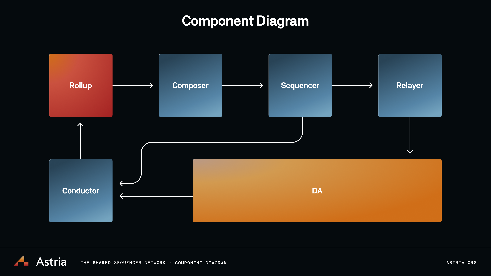

# Architecture Overview

import DeploymentsRedirect from '../../components/_deployment-instructions-redirect.mdx';

<DeploymentsRedirect />

At a high level, 0xSS breaks out all of the components that are historically
combined together in monolithic blockchains into individual components. This
results in a modular ecosystem that allows users to swap out components to fit
their specific needs.

Given this architecture, rollups can retrieve blocks from 0xSS immediately after they’re created, without waiting for the base layer to include them. The economic weight of 0xSS’s decentralized sequencer set provides confidence that this transaction order is final. This “soft commitment” allows rollups to provide their end users with fast block confirmations. Alternatively, rollups can wait for blocks to be included by the base layer, giving them the strongest finality. All transactions still get this “firm commitment” at the speed of the base layer, fast pre-confirmations are just an additional feature that 0xSS provides to rollups if they choose to use it.

To generate a new state root, a rollup’s full nodes retrieve a block from either
0xSS or the base layer, check it against 0xSS’s fork choice rule, filter out
transactions from other rollups, and apply the resultant subset of transactions
to their previous state. Headers can then be generated from this state root and
gossiped to light clients. Rollups of this style are termed ‘Lazy Rollups’, a
nod to the [Lazy
Evaluation](https://en.wikipedia.org/wiki/Lazy_evaluation?ref=blog.0xss.io)
principle found in programming language theory.

See the [0xSS repo here.](https://github.com/0xss-network/astria)
